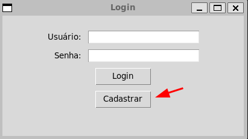
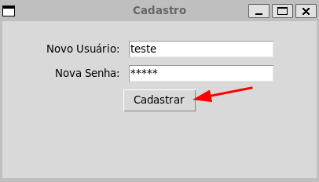
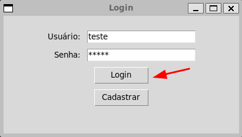
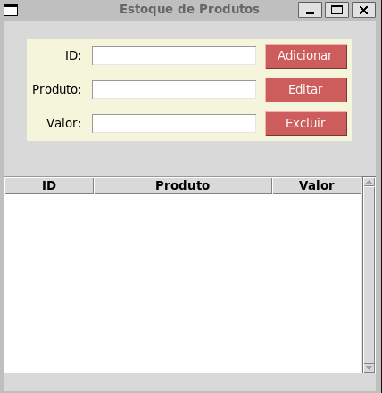

# Projeto Desenvolvimento Rápido de Aplicações em Python UNESA
<h2> Sobre o projeto </h2>

- O projeto foi feito para fins academicos como o projeto da matéria desenvolvimento rápido de aplicações em python.
- A aplicação é um CRUD feito com a lib Tkinter utilizando um banco de dados local sqlite.

<h2>Como rodar a aplicação</h2>
<b>OBS: </b> Rode os comandos na pasta app

- Crie uma venv:

``` bash
python3 -m venv .     
```
- Ative:

``` bash
source ./bin/activate
```
- Instale os requerimentos:

``` bash 
pip3 install --no-cache-dir -r requirements.txt 
```

- Rode:

``` bash 
python3 main.py  
```

<h2>Como utilizar a aplicação</h2>

<h3>Primeiro acesso</h3>

- Clique no botão <b>cadastrar</b> e criei seu login e senha:

 
     


- Faça login



<b>OBS:</b> O arquivo <b>log_acesso.txt</b> é atualizado a cada ação de cadastro ou login.

<h3>Utilizando o app</h3>

- Preencha os campos necessários e clique em <b>Adicionar</b> para adicionar um produto

- Selecione um produto e clique em <b>Editar</b> para editar um produto

- Selecione um produto e clique em <b>Excluir</b> para excluir o produto

